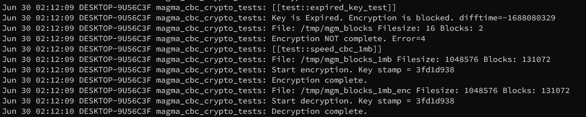

# Отчет по выполнению лабораторной работы 

## Общее описание алгоритма

В работе реализован алгоритм симметричного шифрования ГОСТ 34.12.2018 в версии с размером блока 64 бит и размером ключа 256 бит. Это версия алгоритма ГОСТ 28147-89 "Магма" с фиксированными значениями подстановки.

Всего раундов 32, схема раунда - сеть фейстеля. Раундовое преобразование состоит из операций:
- Сложение в поле Z/2^32
- Подстановка
- Циклический сдвиг влево на 11 бит
- Побитовое гаммирование с раундовым ключом.

Схематически раунд можно представить следующим образом [2]:


В работе используется режим CBC (режим с зацеплением блоков). В данном режиме в качестве дополнительного параметра используется инициализирующий вектор (IV), который предварительно гаммируется со значением шифруемого блока. Также для каждого следующего блока используется результат шифрования текущего, т.е. для блока N инициализирующим вектором будет зашифрованный блок N-1. Схематически это представимо следующим образом:


## Описание криптографических свойств алгоритма

Как уже было отмечено, сам алгоритм построен на основе сети Фейстеля с длиной блока 64 бит. Т.е. за раз в раунде преобразовывается только половина блока - 32 бит.

Раундовые ключи берутся по простой схеме - ключи для раундов 1-24 используются по порядку (первые 32 бит - 1й раундовый ключ, биты 33-64 - второй раундовый ключ и т.д), а для последних восьми ключей - первые восемь в обратном порядке (для 25 раунда - 8й ключ, для 26 - 7й ключ и т.д.)

В книге "Лось, Нестеренко, Рожков КМЗИ" приведена информация, что теоретическую стойкость алгоритма можно определить двумя методами поиска секретного ключа:
- Для метода с трудоемкостью $2^{224}$ требуется $2^{32}$ пар открытых и шифрованных блоков, и $2^{47}$ мегабайт памяти.
- Для метода с трудоемкостью $2^{192}$ требуется $2^{64}$ пар открытых и шифрованных блоков, и $2^{19}$ мегабайт памяти.

---
> Так же стоит отметить, что в данном репозитории содержится реализация "в лоб", без оптимизации и строго по ГОСТ-у. Существует несколько популярных способов оптимизации, но был интерес в написании максимально "оригинального" алгоритма и получения его метрик.
---


## Вычислительная сложность алгоритма

По времени - линейная сложность O(n), где n - количество блоков открытого текста. На практике подтверждено, 1 мегабайт открытого текста шифруется ~700ms.

В процессе работы алгоритма память выделяется только на запись данных ключа и IV, а так же временной переменной для хранения значения блока (весь файл в память не выгружается). Поэтому оценка сложности по памяти - О(1).

//Todo: Перепроверить.

## Общее описание программной реализации алгоритма

Для реализации работы был выбран язык C стандарта C99. В качестве операционной системы используется WSL Linux, в проекте используются системные функции, поэтому проект не является кроссплатформенным.

- Компилятор - gcc 11.1.0
- Язык - C99
- Система сборки - Cmake
- ОС - WSL Linux (Ubuntu 20.04)

Для логирования выполнения процедур шифрования и расшифрования используется демон syslog. Результаты работы можно увидеть в `/var/log/syslog/`:




Для проверки корректности реализации криптографического алгоритма и отлова мелких ошибок был написан ряд тестов на библиотеке gtest. Запустить тесты можно при помощи `make tests`, для этого нужно установить на систему библиотеку gtest (Google Tests).

<details>
  <summary>Результат выполнения тестирования.</summary>

```
[==========] Running 35 tests from 4 test suites.
[----------] Global test environment set-up.
[----------] 10 tests from MAGMA_ROUND_PROCESSING
[ RUN      ] MAGMA_ROUND_PROCESSING.mgm_xor_test_1
[       OK ] MAGMA_ROUND_PROCESSING.mgm_xor_test_1 (0 ms)
[ RUN      ] MAGMA_ROUND_PROCESSING.mgm_xor_test_2
[       OK ] MAGMA_ROUND_PROCESSING.mgm_xor_test_2 (0 ms)
[ RUN      ] MAGMA_ROUND_PROCESSING.mgm_add_test_1
[       OK ] MAGMA_ROUND_PROCESSING.mgm_add_test_1 (0 ms)
[ RUN      ] MAGMA_ROUND_PROCESSING.mgm_add_test_2
[       OK ] MAGMA_ROUND_PROCESSING.mgm_add_test_2 (0 ms)
[ RUN      ] MAGMA_ROUND_PROCESSING.mgm_add_test_3
[       OK ] MAGMA_ROUND_PROCESSING.mgm_add_test_3 (0 ms)
[ RUN      ] MAGMA_ROUND_PROCESSING.mgm_rol_test_1
[       OK ] MAGMA_ROUND_PROCESSING.mgm_rol_test_1 (0 ms)
[ RUN      ] MAGMA_ROUND_PROCESSING.mgm_rol_test_2
[       OK ] MAGMA_ROUND_PROCESSING.mgm_rol_test_2 (0 ms)
[ RUN      ] MAGMA_ROUND_PROCESSING.mgm_rol_test_3
[       OK ] MAGMA_ROUND_PROCESSING.mgm_rol_test_3 (0 ms)
[ RUN      ] MAGMA_ROUND_PROCESSING.mgm_block_xor_1
[       OK ] MAGMA_ROUND_PROCESSING.mgm_block_xor_1 (0 ms)
[ RUN      ] MAGMA_ROUND_PROCESSING.mgm_block_xor_2
[       OK ] MAGMA_ROUND_PROCESSING.mgm_block_xor_2 (0 ms)
[----------] 10 tests from MAGMA_ROUND_PROCESSING (1 ms total)

[----------] 15 tests from MAGMA_GOST_CONTOL_TEST
[ RUN      ] MAGMA_GOST_CONTOL_TEST.mgm_sbox_gost_test_1
[       OK ] MAGMA_GOST_CONTOL_TEST.mgm_sbox_gost_test_1 (0 ms)
[ RUN      ] MAGMA_GOST_CONTOL_TEST.mgm_sbox_gost_test_2
[       OK ] MAGMA_GOST_CONTOL_TEST.mgm_sbox_gost_test_2 (0 ms)
[ RUN      ] MAGMA_GOST_CONTOL_TEST.mgm_sbox_gost_test_3
[       OK ] MAGMA_GOST_CONTOL_TEST.mgm_sbox_gost_test_3 (0 ms)
[ RUN      ] MAGMA_GOST_CONTOL_TEST.mgm_sbox_gost_test_4
[       OK ] MAGMA_GOST_CONTOL_TEST.mgm_sbox_gost_test_4 (0 ms)
[ RUN      ] MAGMA_GOST_CONTOL_TEST.mgm_round_g_test_1
[       OK ] MAGMA_GOST_CONTOL_TEST.mgm_round_g_test_1 (0 ms)
[ RUN      ] MAGMA_GOST_CONTOL_TEST.mgm_round_g_test_2
[       OK ] MAGMA_GOST_CONTOL_TEST.mgm_round_g_test_2 (0 ms)
[ RUN      ] MAGMA_GOST_CONTOL_TEST.mgm_round_g_test_3
[       OK ] MAGMA_GOST_CONTOL_TEST.mgm_round_g_test_3 (0 ms)
[ RUN      ] MAGMA_GOST_CONTOL_TEST.mgm_round_g_test_4
[       OK ] MAGMA_GOST_CONTOL_TEST.mgm_round_g_test_4 (0 ms)
[ RUN      ] MAGMA_GOST_CONTOL_TEST.mgm_key_shedule_1
[       OK ] MAGMA_GOST_CONTOL_TEST.mgm_key_shedule_1 (0 ms)
[ RUN      ] MAGMA_GOST_CONTOL_TEST.mgm_key_shedule_2
[       OK ] MAGMA_GOST_CONTOL_TEST.mgm_key_shedule_2 (0 ms)
[ RUN      ] MAGMA_GOST_CONTOL_TEST.mgm_key_shedule_3
[       OK ] MAGMA_GOST_CONTOL_TEST.mgm_key_shedule_3 (0 ms)
[ RUN      ] MAGMA_GOST_CONTOL_TEST.control_enc_test
[       OK ] MAGMA_GOST_CONTOL_TEST.control_enc_test (0 ms)
[ RUN      ] MAGMA_GOST_CONTOL_TEST.control_dec_test
[       OK ] MAGMA_GOST_CONTOL_TEST.control_dec_test (0 ms)
[ RUN      ] MAGMA_GOST_CONTOL_TEST.control_enc_with_iv_test
[       OK ] MAGMA_GOST_CONTOL_TEST.control_enc_with_iv_test (0 ms)
[ RUN      ] MAGMA_GOST_CONTOL_TEST.control_dec_with_iv_test
[       OK ] MAGMA_GOST_CONTOL_TEST.control_dec_with_iv_test (0 ms)
[----------] 15 tests from MAGMA_GOST_CONTOL_TEST (0 ms total)

[----------] 9 tests from MAGMA_CBC_CONTOL_TEST
[ RUN      ] MAGMA_CBC_CONTOL_TEST.control_cbc_2b
[       OK ] MAGMA_CBC_CONTOL_TEST.control_cbc_2b (1 ms)
[ RUN      ] MAGMA_CBC_CONTOL_TEST.expired_key_test
[       OK ] MAGMA_CBC_CONTOL_TEST.expired_key_test (3 ms)
[ RUN      ] MAGMA_CBC_CONTOL_TEST.speed_cbc_1mb
[       OK ] MAGMA_CBC_CONTOL_TEST.speed_cbc_1mb (697 ms)
[ RUN      ] MAGMA_CBC_CONTOL_TEST.speed_cbc_10mb
[       OK ] MAGMA_CBC_CONTOL_TEST.speed_cbc_10mb (7030 ms)
[ RUN      ] MAGMA_CBC_CONTOL_TEST.speed_cbc_100mb
[       OK ] MAGMA_CBC_CONTOL_TEST.speed_cbc_100mb (69951 ms)
[ RUN      ] MAGMA_CBC_CONTOL_TEST.speed_cbc_1000mb
[       OK ] MAGMA_CBC_CONTOL_TEST.speed_cbc_1000mb (701156 ms)
[ RUN      ] MAGMA_CBC_CONTOL_TEST.keys_swap_10
[       OK ] MAGMA_CBC_CONTOL_TEST.keys_swap_10 (7933 ms)
[ RUN      ] MAGMA_CBC_CONTOL_TEST.keys_swap_100
[       OK ] MAGMA_CBC_CONTOL_TEST.keys_swap_100 (5545 ms)
[ RUN      ] MAGMA_CBC_CONTOL_TEST.keys_swap_1000
[       OK ] MAGMA_CBC_CONTOL_TEST.keys_swap_1000 (5279 ms)
[----------] 9 tests from MAGMA_CBC_CONTOL_TEST (797595 ms total)

[----------] 1 test from SIMPLETEST
[ RUN      ] SIMPLETEST.TRUE_IS_TRUE
[       OK ] SIMPLETEST.TRUE_IS_TRUE (0 ms)
[----------] 1 test from SIMPLETEST (0 ms total)

[----------] Global test environment tear-down
[==========] 35 tests from 4 test suites ran. (797596 ms total)
[  PASSED  ] 35 tests.

```
</details>

## Модель нарушителя

Стоит отметить, что никакая система не является абсолютно безопасной и потенциальный хакер может сидеть на любом уровне системы. Защиты, которые в дальнейшем используются, не помогут от злоумышленника, который имеет контроль над RootOfTrust системы, или который может влиять на процесс выполнения программы.

## Описание программной реализации механизмов защиты
---
- Защита от постоянного использования ключевой информации.

Для вынужденной переодической смены ключевой информации в структуру ключа было добавлено поля с типом `time_t` для хранения временной метки, означающий дату окончания возможности использования ключевой информации. При помощи функции `difftime` проверяется эта информация и если ключ просрочен - процедура шифрования не будет выполнена.

```c
#pragma pack(1)
typedef struct mgm_Key{
    mgm_RoundKey key_block[8];
    time_t exp_time;
} mgm_Key;

...

if ((long)difftime(key_time, current_time) < 0)
{
    syslog(LOG_INFO, "Key is Expired. Encryption is blocked. difftime=%ld", (unsigned long)difftime(key_time, current_time));
    flag_is_error = 4;
}
```
---
- Простая защита от изменения кода.

В качестве простой защиты от изменения кода (секции .text скомпилированного файла) используется некриптографическая проверка целостности следующим образом:

```c
extern char __etext;
static volatile unsigned int crc_code = 0xaae5e06b;
__attribute__((constructor))
void self_check_text()
{
    unsigned int res = gen_crc32(&__etext, 0x14a4); // константа - размер секции
    if (res != crc_code)
    {
        syslog(LOG_INFO, "Bad CRC: control: %08x has: %08x", crc_code, res);
        exit(42);
    }
}
```

Стоит отметить, что:
- Такой способ защиты от изменения не является надежным. Опытный нарушитель может просто отключить такую защиту, например просто заполнив байтом 0x90 (nop) всю функциональную часть проверки. Или исправив опкод условного перехода на безусловный.
- Такой способ привязывает к инфраструктуре gcc. Существуют алтьтернативные способы такой проверки, но выбранный - самый простой. Выбрано из принципа "все можно зареверсить".
---
- Механизмы очистки памяти.

Память самостоятельно не очищается, в компьютерной архитектуре принят принцип что затирается указатель на память, но никак не данные, которые хранились по этому указателю. После выполнения программы ключевая информация может остаться неочищенной в памяти и может быть получена, например при анализе дампа памяти.

Для этого в различных местах работы криптоалгоритма используется функция `memset` для зануления памяти.

---
## Отчет о скорости выполнения тестового задания

### Описание тестового стенда

На стенде используется:
- AMD Ryzen 7 4800hs, 16 ядер.
- 16Гб RAM

### Шифрование и расшифрование произвольных файлов

Для проверки этого пункта и следующего были написаны специальные тесты (в них заложен функционал замера времени выполнения теста). Тесты были выполнены несколько раз* и были получены следующие результаты:

|  Тест  | Запуск 1, ms | Запуск 2, ms | Запуск 3, ms | 
| --- |--- |--- |--- |
|  1mb  | 697 | 728| 706|
|  10mb  | 7030| 7201 | 7043|
|  100mb  | 69951 | 71815| 69770|
|  1000mb  | 701156| 716988| 698272|

В целом заметно, что подтверждается теория о линейной сложности - 1mb открытого текста шифруется за ~700ms и это значение масштабируется на большие размеры файлов с небольшой погрешностью.

\* - нулевой запуск "холостой" для генерации произвольных открытых текстов при помощи `/dev/urandom`. Это занимало небольшое количество времени, что увеличивало время отработки теста на ~15%.
### Шифрование и расшифрование со сменой ключа

Опять же, для этой информации были написаны тесты, в которых генерируюются случайные блоки, IV и ключи. Как и написано в ТЗ, ключи меняются каждые N раундов шифрования, назовем это периодом. Были получены следующие данные о времени шифрования $10^6$ произвольных блоков (~7.6MB):

|  Период  | Создано ключей |Запуск 1, ms | Запуск 2, ms | Запуск 3, ms | 
| --- |--- |--- |--- |--- |
|  10 блоков  | $10^5$ |7933 | 7969 | 7939|
|  100 блоков  | $10^4$ |5545 | 5567 | 5540 |
|  1000 блоков  | $10^3$ |5279 | 5288 | 5299 |

Нужно отметить что в тестах используется предварительное динамическое создание ключей и непосредственно на шифрование-расшифрование тратится немногим меньше времени.

### Данные о нагрузке на систему.

Для проверки нагрузки скомпилируем проект в релизном режиме (`make release`) и проверим нагрузку на примере шифрования файла размером 1GB (артефакт тестирования).

Для этого запустим программу следующим образом:

```bash
$ ./magma_cbc_crypto enc mgm_iv gost_key.bin mgm_blocks_1000mb mgm_blocks_1gb_enc
```

Для фиксирования потребляемых ресурсов можно использовать программы top/htop/bashtop. Информация из bashtop:

```
 Pid: Program:        Arguments:                    Threads: User:  Mem%      ▼Cpu%
23239 magma_cbc_crypt ./magma_cbc_crypto enc mgm_iv gost   1 greg0+  0.0 ⣀⣀⣀⣀⣀  6.2

Memory: 0.0% ⡀⡀⡀⡀⡀⡀⡀⡀⡀⡀⡀⡀⡀⡀⡀ 700 KiB
```

Данные, полученные из утилиты `time` во время процедуры расшифрования файла:

```bash

 > time ./magma_cbc_crypto dec mgm_iv gost_key.bin mgm_blocks_1gb_enc decrypted_info
./magma_cbc_crypto dec mgm_iv gost_key.bin mgm_blocks_1gb_enc decrypted_info  348.43s user 6.03s system 99% cpu 5:54.50 total

```

После процедуры шифрования-расшифрования сверяем файлы и видим что все ОК:

```bash
[ 13:37:00 ]  [ greg0r0  /tmp ]
 > xxd decrypted_info | head -n 2
00000000: e462 704c eca3 aa6f 3214 b153 b9f7 9fd4  .bpL...o2..S....
00000010: 5104 894c f4f3 0e84 d05d 726b 7e35 8fe4  Q..L.....]rk~5..
[ 13:37:01 ]  [ greg0r0  /tmp ]
 > xxd mgm_blocks_1000mb | head -n 2
00000000: e462 704c eca3 aa6f 3214 b153 b9f7 9fd4  .bpL...o2..S....
00000010: 5104 894c f4f3 0e84 d05d 726b 7e35 8fe4  Q..L.....]rk~5..
```

Программа полносью занимает одно из ядер, в моем случае 15-е.

> Если у вас ничего не выводится при запуске программы - значит ложно сработала защита от изменения скомпилированной программы. Простой способ исправить - посмотреть на CRC в /var/log/syslog: `Jun 30 10:41:32 DESKTOP-9U56C3F magma_cbc_crypto: Bad CRC: control: aae5e06b has: 7cf3558b` и исправить значение CRC в main.c.
 
### Проверка аналогичных реализаций.

Не было найдено подходящей реализации ГОСТ 34.12 64 бит в схеме с зацеплением.

Был найден проект https://git.miem.hse.ru/axelkenzo/libakrypt-0.x/-/tree/master, но не получилось вызвать конкретно Магму-CBC для тестирования 1024mb файла.

## Источники

- ГОСТ 34.12-2018 
- ГОСТ 34.13-2018
- RFC 8891 (https://datatracker.ietf.org/doc/html/rfc8891)
- https://spy-soft.net/magma-encryption/
- https://s.top-technologies.ru/pdf/2016/12-3/36513.pdf