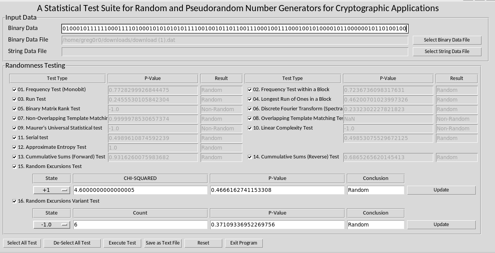

# Отчет по выполнению лабораторной работы

## Общее описание алгоритма программного датчика случайных чисел

В качестве датчика случайных чисел было решено использовать алгоритм DUAL EC, описанный (в уже упраздненном) документе NIST Special Publication 800-90A: Recommendation for Random
Number Generation Using Deterministic Random Bit Generators. Выбор пал на этот алгоритм по двум причинам:
- Хотелось реализовать что-то на основе эллиптичеких кривых.
- Интересно было реализовать изначально уявзимый генератор и его улучшенную версию.

Сам алгоритм устроен следующим образом:


Имеем эллиптическую кривую E и две точки - P и Q.
Раунд генерации нового состояние описан следующими преобразованиями:

- state(i+1) = x(state(i) * P)
- result = x(state(i+1)*Q)
- return (result & mask)

Где state - внутреннее состояние, x() - функция, возвращающая координату X точки на кривой E, return - состояние, которое возвращается из генератора.

Стойкость алгоритма определяется по кривой, используемой для конструкции.

## Вычислительная сложность алгоритма, как временная, так и по памяти

Временная - O(N), где N - количество необходимых состояний на выход.
По памяти - O(1). Для генерации нового состояния требуется константное количество памяти.

## Выполнение тестов NIST

Для проверки на NIST-овых тестах были сгенерированы небольшие чанки информации по 100-200 байт и проверены в программе [5]. В целом реализация показывает хорошие результаты, из 15 тестов не проходит 3 теста, не учтен тест Overlapping Template Matching, так как выдавал ошибку.



<details>
  <summary>Результат выполнения тестирования на более длинном тесте (32кб).</summary>

```
Execute
01. Frequency Test (Monobit)  selected.  (0.03045955303279035, True)
02. Frequency Test within a Block  selected.  (0.33979867779651046, True)
03. Run Test  selected.  (0.40243139537693706, True)
04. Longest Run of Ones in a Block  selected.  (0.7664031855432394, True)
05. Binary Matrix Rank Test  selected.  (0.6078405191780922, True)
06. Discrete Fourier Transform (Spectral) Test  selected.  (0.5614368805383468, True)
07. Non-Overlapping Template Matching Test  selected.  (0.9421758530564371, True)
08. Overlapping Template Matching Test  selected.  (0.905630624596317, True)
09. Maurer's Universal Statistical test  selected.  (-1.0, False)
10. Linear Complexity Test  selected.  (0.48012877958431954, True)
11. Serial test  selected.  ((0.6146907456501566, True), (0.6470374948958744, True))
12. Approximate Entropy Test  selected.  (0.12426822122748123, True)
13. Cummulative Sums (Forward) Test  selected.  (0.05091681842082128, True)
14. Cummulative Sums (Reverse) Test  selected.  (0.05091681842082128, True)
15. Random Excursions Test  selected.  [('-4', -4, 2.38510800286081, 0.7936897488312303, True), ('-3', -3, 1.605574344023323, 0.9005744197858643, True), ('-2', -2, 3.484108987510348, 0.6257934933387903, True), ('-1', -1, 3.664723032069971, 0.5986223513158295, True), ('+1', 1, 0.49854227405247814, 0.9921765719848856, True), ('+2', 2, 3.6538530756217833, 0.6002460557811642, True), ('+3', 3, 1.0956548104956276, 0.9544875673313057, True), ('+4', 4, 4.638697675774064, 0.4615432736155469, True)]
16. Random Excursions Variant Test  selected.  [('-9.0', -9.0, 397, 0.6170448899661127, True), ('-8.0', -8.0, 372, 0.7749667365012234, True), ('-7.0', -7.0, 326, 0.8571386795229025, True), ('-6.0', -6.0, 282, 0.48254374915962994, True), ('-5.0', -5.0, 259, 0.28504940740261286, True), ('-4.0', -4.0, 269, 0.2855766541470549, True), ('-3.0', -3.0, 304, 0.5054666580273481, True), ('-2.0', -2.0, 318, 0.5815765093147944, True), ('-1.0', -1.0, 321, 0.4009286258828433, True), ('+1.0', 1.0, 335, 0.760029979933962, True), ('+2.0', 2.0, 330, 0.774446669507727, True), ('+3.0', 3.0, 354, 0.8510164724808508, True), ('+4.0', 4.0, 363, 0.7728760056977232, True), ('+5.0', 5.0, 340, 0.9695440255014282, True), ('+6.0', 6.0, 326, 0.8448450918883701, True), ('+7.0', 7.0, 327, 0.8654596744604623, True), ('+8.0', 8.0, 342, 0.9921345180293343, True), ('+9.0', 9.0, 337, 0.9556920763701305, True)]
```

</details>

## Улучшения алгоритма

На счет этого алгоритма было множество различных скандалов и независимых исследований, которые привели к тому, что этому алгоритму не доверяли. 

Но ряд независимых исследований ([1] и [2] например) пришли к тому, что проблемы алгоритма можно решить следующими улучшениями

- Тотальное хеширование результатов, возвращаемых из генератора
- Уменьшение размером снимаемых битов с состояния, т.е. уменьшение размеров маски. В оригинальном алгоритме не снимаются только 16 бит, которые легко восстановить.

## Отчет о скорости выполнения тестового задания

Изначально было понятно, что самые "толстые" тесты не отработают за нужное время из-за алгебры вычисления точек на кривой. Поэтому тест на 100 и 1000 мегабайт присутствует в тестировании, но имеет аттрибут `DISABLED_`, так как смысла его запускать с текущей версией библиотеки работы с ЭК нет.

### Описание тестового стенда

На стенде используется:
- AMD Ryzen 7 4800hs, 16 ядер.
- 16Гб RAM

### Генерация случайного файла размером

|  Тест  | Запуск 1, ms | Запуск 2, ms | 
| --- |--- |--- |
|  1mb  | 224396681 | 221249536 | 
|  100mb*  | 20971520000 | 20971520000|
|  1000mb*  | 209715200000| 209715200000| 

\* - Теоретическое время, при учете того, что время генерации нового значения ~200ms
### Генерация некоторого случайного количества ключей

Для генерации ключей было выбрано количество в 1000 единиц. Генерировались ключи, соответствующие структуре ключа, используемых в первой лабораторной работе, т.е 32 байта ключа + 8 байт временной метки.

Для генерации 1000 ключей требуется около 20 минут:

```
[ RUN      ] _ECC_EC_DUAL_EC_PRNG_v2.speed_1000keys
[       OK ] _ECC_EC_DUAL_EC_PRNG_v2.speed_1000keys (1049312 ms)
```

### Общее описание программной реализации алгоритма.

Реализация написана на языке C++ под платформу Linux x64. Реализацию можно разделить на две части:
- Самописная библиотека для работы с эллиптическими кривыми
- Реализация оригинального и улучшенного датчика PRNG.

### Ссылки

- https://link.springer.com/chapter/10.1007/978-3-540-74143-5_26
- http://rump2007.cr.yp.to/15-shumow.pdf
- https://lib.itsec.ru/articles2/crypto/dual-ec-kriptograficheskiy-standart-s-lazeykoy
-  https://nvlpubs.nist.gov/nistpubs/Legacy/SP/nistspecialpublication800-90.pdf
- https://github.com/stevenang/randomness_testsuite